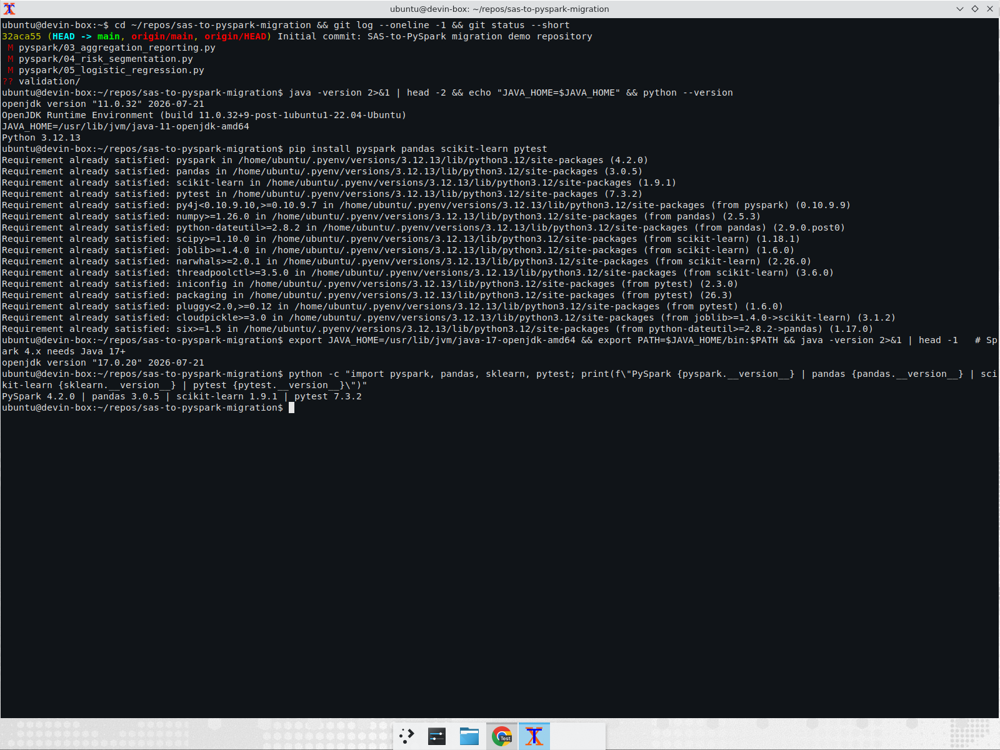
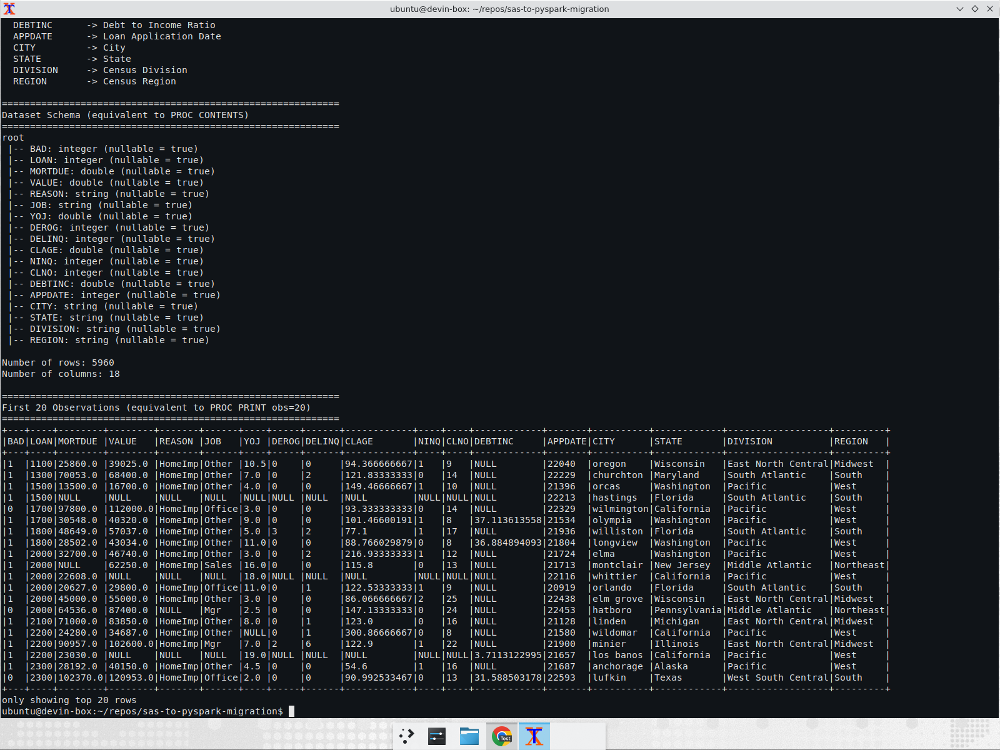
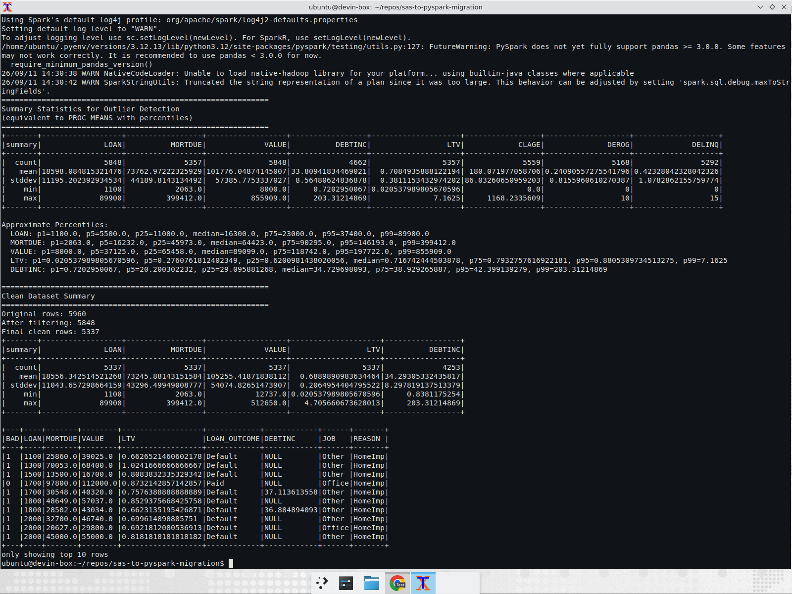
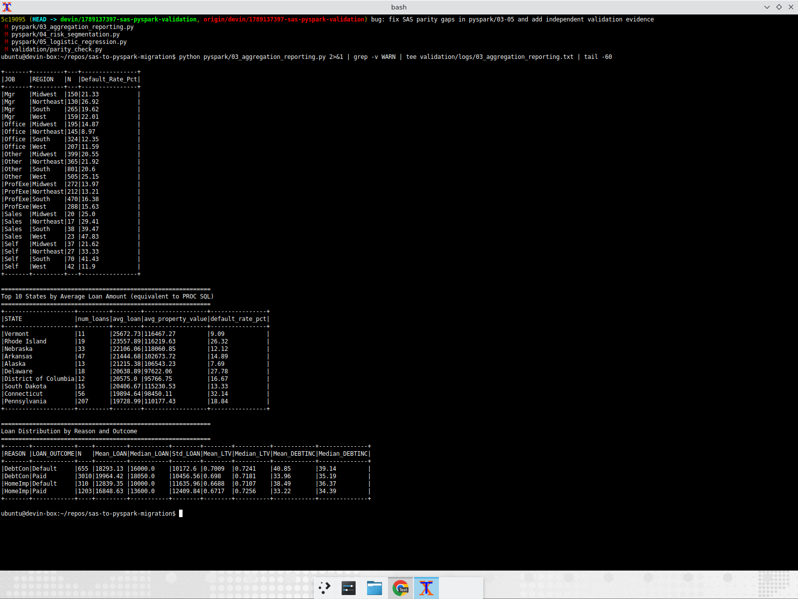
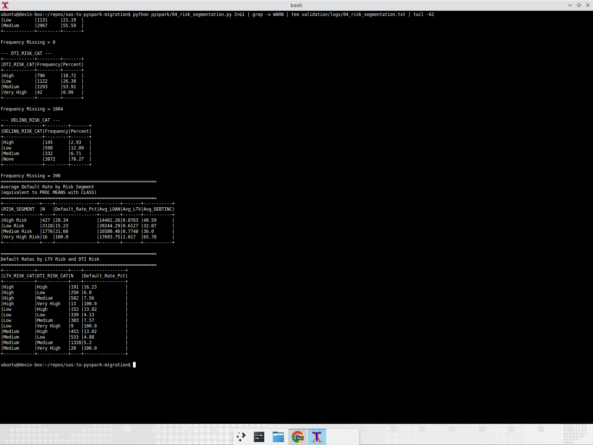
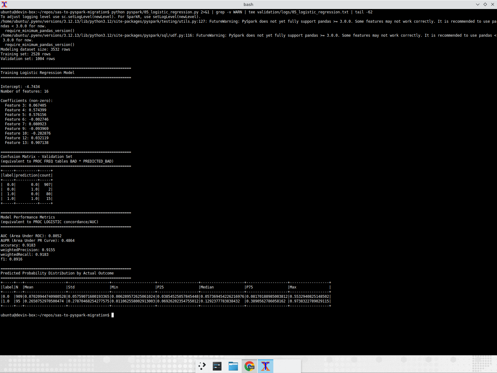
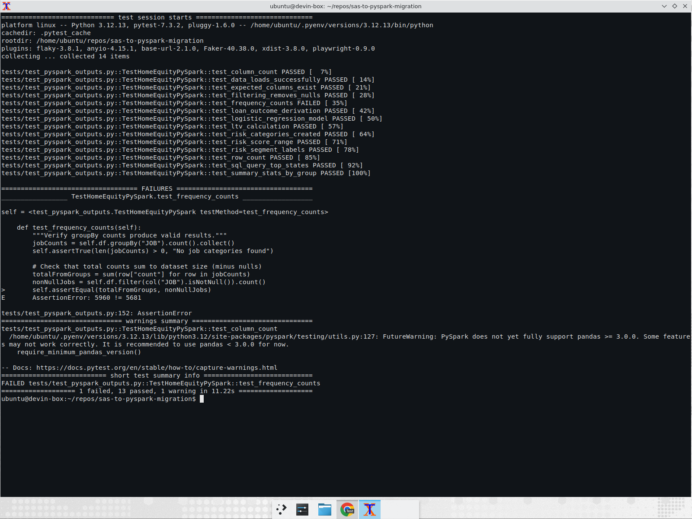
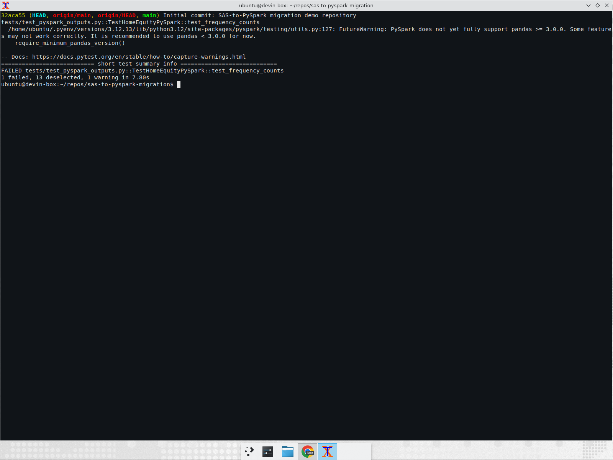
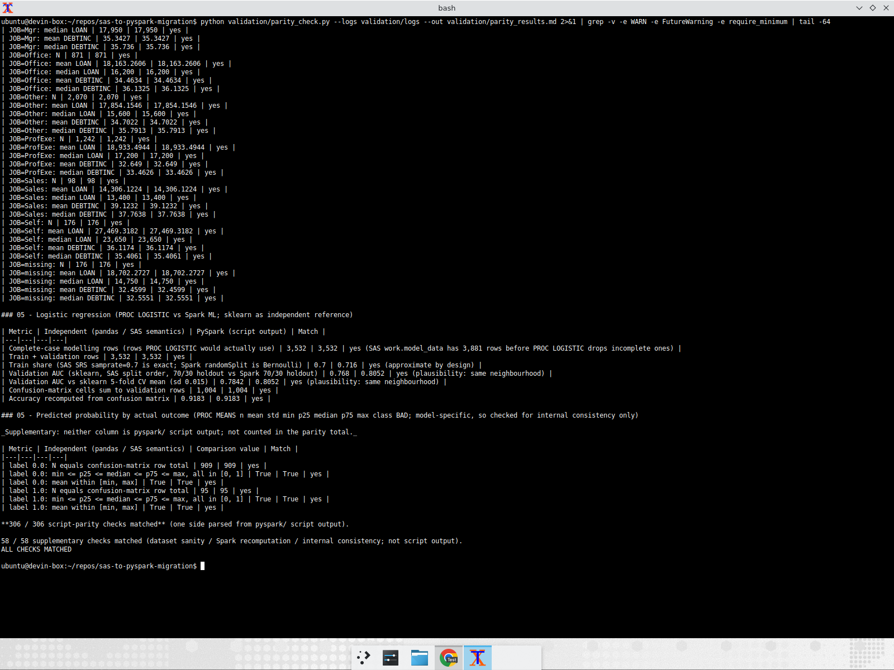

# Validation: PySpark migration vs. SAS semantics

This document is the evidence that `pyspark/01..05` actually run, and that the
numbers they print are what the SAS programs under `sas/` would have produced.
Nothing here relies on the PySpark code checking itself: every figure in the
"Independent" column was recomputed a second way, with **pandas / plain Python /
scikit-learn straight off `data/home_equity.csv`**, following the semantics of
the SAS programs (not the PySpark code). The comparison itself is automated in
[`validation/parity_check.py`](validation/parity_check.py); the full output is
in [`validation/parity_results.md`](validation/parity_results.md).

The harness keeps two kinds of checks apart so the headline number is honest:

* **script-parity checks** – one side is parsed from what the `pyspark/`
  script under test actually printed, the other is pandas following the SAS
  program. These are the only checks counted in the headline total.
* **supplementary checks** – neither side is script output: dataset sanity
  anchors (5,960 rows / 19.95% BAD vs the documented HMEQ facts – no SAS or
  PySpark step prints the raw BAD rate), Spark recomputations of numbers the
  scripts do not print (LOAN/DEBTINC by REASON and by JOB, which the brief
  asked for), and internal-consistency checks on the model output. Reported,
  but never added to the parity total.

Everything below was run on a single machine, in a visible terminal, with a
screen recording running (attached to the PR / delivered separately).

## Environment

| Item | Value |
|---|---|
| OS | Ubuntu Linux |
| Java | OpenJDK 17.0.20 (`JAVA_HOME=/usr/lib/jvm/java-17-openjdk-amd64`) |
| Python | 3.12.13 |
| PySpark | 4.2.0 |
| pandas / scikit-learn / pytest | 3.0.5 / 1.9.1 / 7.3.2 |
| Base commit validated | `32aca55` (origin/main) + the fixes in this PR |



## Headline result

* All five scripts run to completion with exit code 0.
* **306 / 306 script-parity checks match** after the fixes in this PR, plus
  58 / 58 supplementary checks (108 / 306 and 52 / 56 on untouched
  `origin/main` with the same harness – see "Real discrepancies").
* `tests/test_pyspark_outputs.py`: **13 passed, 1 failed**. The failure
  (`test_frequency_counts`) is a pre-existing bug in the *test*, reproduces
  identically on untouched `origin/main`, and is unrelated to the migration
  logic. It was **not** silently patched – see "Test-suite issue".

## Parity table (metric / SAS-expected or independent value / PySpark value / match?)

Independent values follow SAS semantics: `work.home_equity_final` is the raw
data with LOAN/VALUE/BAD non-missing, `LOAN > 0`, `VALUE > 0`, and
`0 < LTV < 5` (from `sas/02_data_cleaning.sas`). PROC FREQ excludes missing
values from the table and from the percent base by default; PROC MEANS
`class` statements drop rows with a missing class value.

### 01 – Data loading

| Metric | SAS-expected / independent | PySpark | Match? |
|---|---|---|---|
| Raw row count (HMEQ documented: 5,960) | 5,960 | 5,960 | yes |
| Column count | 18 | 18 | yes |
| First 20 observations (PROC PRINT obs=20): BAD / LOAN / MORTDUE / VALUE incl. missing | 20 rows from the CSV | 20 rows printed by 01 | yes (20/20) |
| BAD default rate (HMEQ documented: ~19.95%) – *supplementary*, no script prints it | 19.95% (1,189 / 5,960) | – | yes vs documented value |

### 02 – Cleaning / derived columns

| Metric | SAS-expected / independent | PySpark | Match? |
|---|---|---|---|
| Rows after LOAN/VALUE/BAD not-missing | 5,848 | 5,848 | yes |
| Final clean rows (`work.home_equity_final`) | 5,337 | 5,337 | yes |
| LTV = MORTDUE/VALUE for every row of the printed sample (10 rows) | recomputed from the MORTDUE/VALUE the script printed | LTV column printed by 02 | yes (10/10) |
| LTV n / mean / std / min / max | 5,337 / 0.6890 / 0.2065 / 0.0205 / 4.7057 | same | yes |
| LOAN mean / std / min / max | 18,556.34 / 11,043.66 / 1,100 / 89,900 | same | yes |
| MORTDUE, VALUE, DEBTINC n/mean/std/min/max | see parity_results.md | same | yes (20/20) |

### 03 – Aggregation & reporting

| Metric | SAS-expected / independent | PySpark | Match? |
|---|---|---|---|
| JOB frequencies (6 levels) + percents, Frequency Missing = 176 | e.g. Other 2,070 (40.11%), ProfExe 1,242 (24.07%) | same | yes (14/14) |
| REASON frequencies, Frequency Missing = 159 | DebtCon 3,665 (70.78%), HomeImp 1,513 (29.22%) | same | yes |
| LOAN_OUTCOME frequencies | Paid 4,340 (81.32%), Default 997 (18.68%) | same | yes |
| REGION frequencies (4 levels) | South 2,039 (38.20%), West 1,266 (23.72%), ... | same | yes |
| Mean / median LOAN by outcome | Paid 19,000.71 / 16,900; Default 16,621.97 / 14,800 | same | yes |
| Mean / median MORTDUE, VALUE, DEBTINC by outcome (PROC MEANS `n mean median std min max`) | e.g. DEBTINC Paid 33.73 / 34.93; Default 40.52 / 38.36 | same | yes (22/22 for the whole table) |
| **Mean / median LOAN by REASON** (supplementary – no SAS/PySpark step prints this; Spark recomputed vs pandas) | DebtCon 19,665.73 / 17,700; HomeImp 16,027.16 / 12,900; missing 17,051.57 / 17,000 | same | yes |
| **Mean / median DEBTINC by REASON** (supplementary) | DebtCon 34.52 / 35.56; HomeImp 33.67 / 34.55; missing 34.77 / 34.41 | same | yes |
| **Mean / median LOAN by JOB** (supplementary) | Mgr 18,768.89 / 17,950; Office 18,163.26 / 16,200; Other 17,854.15 / 15,600; ProfExe 18,933.49 / 17,200; Sales 14,306.12 / 13,400; Self 27,469.32 / 23,650; missing 18,702.27 / 14,750 | same | yes |
| **Mean / median DEBTINC by JOB** (supplementary) | Mgr 35.34 / 35.74; Office 34.46 / 36.13; Other 34.70 / 35.79; ProfExe 32.65 / 33.46; Sales 39.12 / 37.76; Self 36.12 / 35.41; missing 32.46 / 32.56 | same | yes |
| REASON × outcome (PROC MEANS class REASON LOAN_OUTCOME): 4 groups, missing REASON (159 rows) dropped by CLASS; N / mean+median LOAN / mean+median LTV / mean+median DEBTINC | 4 groups, 32 values | same | yes (34/34) |
| Default % by JOB × REGION (PROC TABULATE class JOB REGION): 24 cells, missing JOB (176 rows) dropped by CLASS; N + % | 24 cells | same | yes (50/50) |
| Top-10 states by avg LOAN (PROC SQL), order + values | Vermont 25,672.73 ... Pennsylvania 19,728.99 | same | yes (10/10) |

### 04 – Risk segmentation

| Metric | SAS-expected / independent | PySpark | Match? |
|---|---|---|---|
| Rows in risk dataset | 5,337 | 5,337 | yes |
| RISK_SEGMENT Low / Medium / High / Very High (+ percents) | 3,118 / 1,776 / 427 / 16 | 3,118 / 1,776 / 427 / 16 | yes |
| LTV_RISK_CAT Low / Medium / High (+ percents) | 1,131 / 2,967 / 1,239 | same | yes |
| DTI_RISK_CAT Low / Medium / High / Very High, Frequency Missing (PROC FREQ: percents over non-missing) | 1,122 (26.38%) / 2,293 (53.91%) / 796 (18.72%) / 42 (0.99%), missing 1,084 | same | yes |
| DELINQ_RISK_CAT None / Low / Medium / High, Frequency Missing | 3,872 / 598 / 332 / 145, missing 390 | same | yes |
| Default % by LTV_RISK_CAT × DTI_RISK_CAT (PROC FREQ tables LTV*DTI*BAD): 12 cells N + % | 12 cells | same | yes (24/24) |
| Default % by segment | Low 15.23, Medium 21.68, High 28.34, Very High 100.0 | same | yes |
| Avg LOAN / LTV / DEBTINC by segment | 12 values | same | yes (12/12) |

### 05 – Logistic regression

| Metric | SAS-expected / independent | PySpark | Match? |
|---|---|---|---|
| Complete-case modelling rows (rows PROC LOGISTIC would actually use: 8 numeric + JOB + REASON non-missing) | 3,532 (SAS `work.model_data` has 3,881 before PROC LOGISTIC drops incomplete rows) | 3,532 | yes |
| Train share | 0.70 (SAS `samprate=0.7` is exact) | 0.716 (2,528 / 3,532) | yes – approximate by design (`randomSplit` is Bernoulli) |
| Validation AUC – Spark ML vs scikit-learn LogisticRegression, same features, SAS order of operations (filter on the 6 key predictors → unstratified 70/30 split → drop remaining incomplete rows) | 0.768 (sklearn holdout) | **0.8052** | plausible – same neighbourhood |
| Validation AUC – vs sklearn 5-fold CV mean (sd 0.015) | 0.784 ± 0.015 | 0.8052 | plausible |
| Confusion-matrix cells sum to validation rows | 1,004 | 907 + 2 + 80 + 15 = 1,004 | yes |
| Accuracy recomputed from confusion matrix | 0.9183 | 0.9183 | yes |
| Predicted-probability summary by actual outcome (PROC MEANS `n mean std min p25 median p75 max`) – supplementary, model-specific | N = confusion-matrix row totals (909 / 95); min ≤ p25 ≤ median ≤ p75 ≤ max in [0, 1] | same | yes (6/6) |

The AUC is not expected to be bit-identical: SAS `PROC SURVEYSELECT` draws an
exact 70% simple random sample, Spark `randomSplit` is a per-row Bernoulli
split, and Spark ML / sklearn / PROC LOGISTIC use different optimisers and
regularisation defaults. 0.805 vs 0.77–0.80 on ~1,000 validation rows is
within the sampling noise of a single split (sd ≈ 0.015 across CV folds; the
holdout figure moves by several points depending on the seed and on whether
the split is stratified), so the Spark model is credible. This is a
plausibility check, not a parity check.

## Real discrepancies found (and fixed in this PR)

Running the same harness against untouched `origin/main` gave
**108 / 306 script-parity matches** ([`validation/parity_results_before_fixes.md`](validation/parity_results_before_fixes.md)).
Every mismatch traced back to one of the genuine migration bugs below:

1. **Missing SAS LTV sanity filter in 03, 04 and 05 (real bug).**
   `sas/02_data_cleaning.sas` builds `work.home_equity_final` with
   `0 < LTV < 5` in addition to the not-missing / `> 0` checks. The PySpark
   scripts 03–05 "replicate cleaning from script 02" but dropped that clause,
   so they operated on 5,848 rows instead of 5,337 (491 rows with missing
   MORTDUE/VALUE plus 20 with LTV ≥ 5 leaked in). Downstream effect on main:
   Default N 1,084 vs 997, risk dataset 5,848 vs 5,337, RISK_SEGMENT Low 3,603
   vs 3,118, modelling rows 3,548 vs 3,532, AUC 0.7642 vs 0.8052, and every
   percentage in 03/04 shifted. Fix: added `(LTV > 0) & (LTV < 5)` to the
   filter in `pyspark/03`, `04`, `05`.

2. **PROC FREQ missing-value semantics in 03 and 04 (real bug).**
   SAS PROC FREQ drops missing values from the table and from the percent
   denominator and prints `Frequency Missing = n`. The PySpark versions kept a
   `NULL` row and divided by the full count (e.g. JOB=Other 40.15% vs 40.11%;
   DTI_RISK_CAT Medium 42.96% vs 53.91%). Fix: filter nulls before the
   groupBy, use the non-missing count as the percent base, print
   `Frequency Missing`, and drop null cells from the LTV × DTI cross-tab.

3. **PROC MEANS / TABULATE `class` semantics in 03 (real bug).** A SAS
   `class` statement without `/ missing` drops observations whose class value
   is missing. `groupBy("REASON", "LOAN_OUTCOME")` and `groupBy("JOB",
   "REGION")` emitted extra `NULL` groups (159 and 176 rows) that SAS would
   never report. Fix: filter the class columns to non-null first.

4. **Statistics missing from 03 and 05 (real gap).** `sas/03` runs `PROC MEANS
   n mean median std min max` on LOAN MORTDUE VALUE DEBTINC and `n mean std
   median` on LOAN LTV DEBTINC by REASON; the PySpark version only printed
   means (and only for some variables). `sas/05` runs `PROC MEANS n mean std
   min p25 median p75 max` on the predicted probability. Fix: added the
   missing `Median_*` columns (Spark `median()`) in 03 and the full
   N/Mean/Std/Min/P25/Median/P75/Max summary (`percentile()`) in 05.

5. **Duplicate dict key in 05 (real bug, output only).**
   `.agg({"pred_prob": "count", "pred_prob": "mean"})` – Python keeps only the
   last key, so the count column was silently dropped. Fix: explicit
   `count(...).alias("N"), mean(...).alias("Mean"), ...`.

Nothing else was off. Missing-value handling on load, `inferSchema`, the LTV
formula, the risk-bucket thresholds, composite score and segment labels,
the JOB × REGION tabulate, the PROC SQL top-10 states and the SAS-style
half-up rounding all agree exactly.

## Harmless differences (not bugs)

* **Train/validation split**: 71.6% / 28.4% instead of exactly 70/30 –
  Bernoulli `randomSplit` vs SAS exact SRS. Expected.
* **AUC 0.8052 vs 0.768 (sklearn holdout) / 0.784 (sklearn 5-fold CV)** –
  different optimiser/regularisation and a different random split; within
  noise (see above).
* **Spark `NULL` vs SAS `.`** in printed output – display only.
* PySpark 4.2 prints a `FutureWarning` that pandas ≥ 3.0 is not fully supported
  by `pyspark.testing`; it only affects the test helper import, not the scripts.

## Test-suite issue (pre-existing, not changed here)

`tests/test_pyspark_outputs.py::test_frequency_counts` fails with
`AssertionError: 5960 != 5681`. It sums `df.groupBy("JOB").count()` (which
includes the `NULL` JOB group, 279 rows) and compares to
`df.filter(col("JOB").isNotNull()).count()`. Those can never be equal on data
with missing JOB, so the assertion is wrong, not the code under test. The same
failure occurs on untouched `origin/main` (screenshot below). Per the brief
("don't invent problems") the test was left as-is; the one-line fix is to
compare against `df.count()`.

## Terminal runs (screenshots)

`python pyspark/01_data_loading.py` – 5,960 rows × 18 columns



`python pyspark/02_data_cleaning.py` – 5,960 → 5,848 → 5,337 rows



`python pyspark/03_aggregation_reporting.py`



`python pyspark/04_risk_segmentation.py`



`python pyspark/05_logistic_regression.py` – AUC 0.8052



`python -m pytest tests/test_pyspark_outputs.py -v` – 13 passed, 1 failed



Same test on untouched `origin/main` (`32aca55`) – same failure



`python validation/parity_check.py --logs validation/logs` – 306 / 306 script-parity, 58 / 58 supplementary



## Reproduce

```bash
export JAVA_HOME=/usr/lib/jvm/java-17-openjdk-amd64   # any Java 8/11/17
pip install pyspark pandas scikit-learn pytest
for s in pyspark/0*.py; do python "$s"; done
python -m pytest tests/test_pyspark_outputs.py -v
python validation/parity_check.py            # re-runs the scripts and compares
```

Raw terminal logs from the terminal runs are in `validation/logs/`. Scripts
01, 02 and the pytest run are from the screen-recorded session; 03, 04, 05 and
the parity check were re-run (and re-screenshotted) after the review fixes to
03–05 so that logs, screenshots and `parity_results.md` reflect the code in
this PR.
